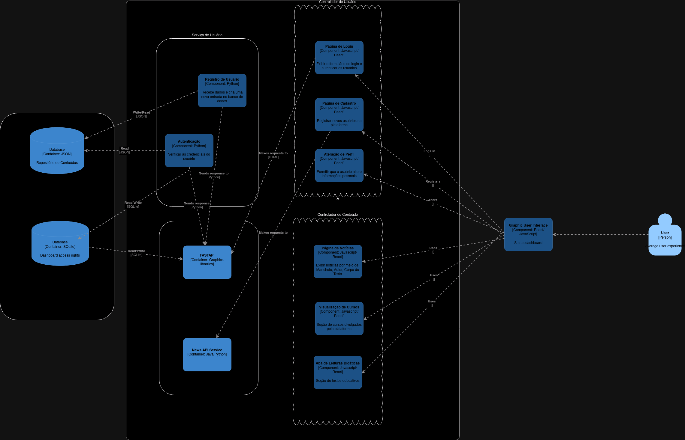

# Diagrama de Componentes 

Para melhor visualização, confira o link https://drive.google.com/drive/folders/1hWtbcHJ1Zt3eKSoInFSqEd-J8oWj2qLX?usp=sharing

## Descrição textual das componentes
### 1) Controlador de usuário
- **Responsabilidade**: Gerenciar interações de entrada do usuário, ou seja, ele deve receber e coordenar as ações iniciadas pelo usuário na interface (frontend) da plataforma, como login, cadastro e alterações no perfil;
- **Interface**: Deverá expor endpoints para cadastro, recuperação de senha e atualização de dados, por meio dos quais será feita a comunicação entre o frontend (interface visualizada pelo usuário) e o backend (banco de dados);
- **Dependências**: Serviço de usuário.
  ### 1.1) Página de login
  - **Responsabilidade**: Exibir o formulário de login e autenticar os usuários ao sistema. Ela coleta as credenciais (uemail e senha) e realiza a validação básica de dados, enviando-os ao serviço de autenticação do sistema para verificar a validade. Caso o login seja bem-sucedido, redireciona o usuário para a interface principal da plataforma. Em caso de falha, exibe as mensagens de erro apropriadas.
  ### 1.2) Página de cadastro
  - **Responsabilidade**: Permitir que novos usuários se registrem no sistema. Exibe o formulário de cadastro, coletando dados como nome, e-mail, senha, e outras informações necessárias para o perfil. Realiza validações preliminares, como verificação de unicidade do email digitado (para que não seja permitido que o mesmo email esteja vinculado a mais de um usuário), e envia os dados ao sistema para criação de uma nova conta.
  ### 1.3) Alteração de perfil
  - **Responsabilidade**: Permitir que o usuário edite suas informações pessoais, como nome, senha, perfil de investidor, entre outros. Esta componente exibe o formulário de edição e lida com a validação dos dados atualizados.

### 2) Serviço de usuário
- **Responsabilidade**: Receber as solicitações dos controladores (como a **Página de login**, **Página de cadastro** e **Alteração de perfil**), processá-las e interagor com o banco de dados para garantir que as informações dos usuários sejam atualizadas, consultadas e validadas conforme necessário;
- **Dependências**: Banco de dados.
  ### 2.1) Autenticação
  - **Responsabilidade**: Verificar as credenciais do usuário para autorizar ou negar acesso. Ao receber dados de login, o serviço consulta o banco de dados e compara as informações de forma segura, permitindo o acesso apenas em caso de correspondência.
  ### 2.2) Registro de usuário
  - **Responsabilidade**: Recebr os dados enviados pela **Página de cadastro** e criar uma nova entrada para o usuário no banco de dados.

### 3) Controlador de conteúdo
- **Responsabilidade**: Gerenciar as solicitações de conteúdo feita pelos usuários na interface, ou seja, ele deve receber uma demanda do usuário e coordenar o fluxo de dados para entregar as informações corretas na interface;
- **Interface**: Como exemplos de conteúdos exibidos pela interface e que podem ser acessados pelo usuário na plataforma (e que também serão tratados como componentes no diagrama), temos:
  ### 3.1) Página de notícias
  - **Responsabilidade**: Recebe a solicitação para exibir uma notícia e retornar parâmetros dela para o usuário, como manchete, autor, data de publicação e corpo do texto.
  ### 3.2) Visualização de cursos
  - **Responsabilidade**: Permitir que o usuário visualize a lista de cursos divulgados pela plataforma e informações básicas deles, como uma breve descrição e um link para seu acesso.
  ### 3.3) Aba de leituras didáticas
  - **Responsabilidade**: Permitir que o usuário explore leituras didáticas, organizadas por parâmetros de categoria e dificuldade. Ao selecionar um texto, o controlador deve exibir o texto, em sua íntegra, para o usuário.
- **Dependências**: Repositório de conteúdos e APIs externas públicas.

### 4) Repositório de conteúdos
- **Responsabilidade**: Lidar diretamente com a persistência dos dados relacionados aos conteúdos exibidos pelo controlador de conteúdos, isto é, ele é responsável por adicionar e manter atualizadas as notícias, leituras e os cursos exibidos para os usuários, mantendo também organizadas as informações essenciais sobre esses;
- **Dependências**: Banco de dados.

### 5) Banco de dados
- **Responsabilidade**: Armazenar os dados relacionados aos usuários e aos conteúdos da plataforma de maneira organizada e persistente, permitindo o funcionamento correto do site.

## Estilos arquiteturais adotados
### 1) Cliente-Servidor
- **Justificativa**: Tal estilo é extremamente útil para a organização da comunicação entre o frontend e o backend da plataforma. Com isso, temos bem definida a separação de responsabilidades, na qual o frontend atua como cliente, enviando requisições para o backend (servidor), no qual residem a lógica de controle e dos serviços. Entre as vantagens que podemos extrair da adoção desse estilo, temos a obtenção de uma solução mais modular, o que facilita o gerenciamento dos estados da aplicação no frontend e o armazenamento de dados no backend.
