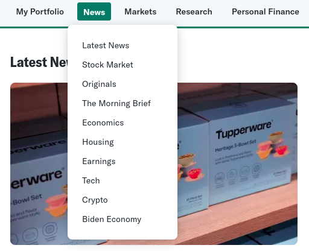

# Features a serem desenvolvidas no projeto
### Robô quantitativo

### Notícias
Uma aba contendo notícias recentes relacionadas ao mundo de finanças e investimentos visando a manter os usuários atualizados sobre as movimentações do mercado. A ideia é que o site tenha acesso a notícias de fontes confiáveis e consiga exibir suas manchetes e links para os usuários, direcionando-os para a íntegra da notícia. *(feito)*

### Divulgação de cursos
Desenvolver uma página de recomendações de cursos sobre educação financeira. A ideia é que os usuários possam usar esta ferramenta como um portal que centraliza informações/aulas de diversas páginas sobre diferentes tópicos relacionados a finanças. *(feito)*

### Leituras didáticas
Desenvolver uma página que ofereça textos educativos organizados de maneira acessível e fluida. A ideia é criar uma experiência de leitura contínua e imersiva, permitindo que o usuário se concentre completamente no conteúdo. Para isso, foram analisadas interfaces que priorizam a leitura sem interrupções ou atividades complementares, destacando pontos de inspiração para o projeto. *(feito)*

---

# Registro da execução da técnica de elicitação de requisitos
## Técnica escolhida: Benchmarking

### Ayn Rand Institute - Free Books for Students

- **Destaques**: Essa página oferece uma seleção de livros gratuitos com uma organização limpa e simples. Os livros são apresentados com suas capas em destaque, o que facilita a escolha visual do conteúdo.
- **Inspiração**: A apresentação visual clara dos livros, com grande foco nas capas e no título, pode ser adaptada para o site de leitura didática. Oferecer aos usuários uma biblioteca visual de textos educativos, com ícones ou capas que ajudem a identificar rapidamente os temas de interesse, pode melhorar a experiência de navegação e escolha de leitura.
- **Pontos Negativos**: A página, no entanto, é bastante estática e carece de interatividade, o que pode desmotivar o usuário a explorar mais profundamente o conteúdo. A ausência de personalização nas recomendações também pode ser uma limitação, pois não facilita que o usuário encontre o conteúdo ideal baseado em suas preferências ou interesses específicos.

### Medium

- **Destaques**: O design do Medium foca em uma leitura imersiva, com artigos apresentados de forma simples e organizada. A página inicial lista os artigos de maneira clara, com títulos, imagens pequenas e uma breve introdução, criando um fluxo contínuo de leitura.
- **Inspiração**: O site de leitura didática pode seguir a simplicidade do Medium, onde os textos são o elemento principal. A organização dos textos com títulos destacados e breves descrições antes do conteúdo completo pode facilitar a navegação do usuário, sem sobrecarregar a página com informações excessivas. O uso de uma interface responsiva e bem espaçada, como no Medium, melhora a fluidez da leitura e mantém o foco no conteúdo.
- **Pontos Negativos**: Apesar do design limpo, a falta de categorização e de filtros mais específicos pode dificultar a localização de conteúdo relevante rapidamente. Além disso, as imagens pequenas não agregam tanto ao conteúdo visual, o que pode ser um problema em seu site, que pode demandar gráficos mais robustos para explicar conceitos complexos de robôs quantitativos.

### Wikipedia

- **Destaques**: A Wikipedia é conhecida por sua vasta quantidade de conteúdo organizado de forma estruturada. Os textos são divididos em seções e subtítulos, permitindo que o usuário navegue facilmente por diferentes tópicos. Além disso, a plataforma oferece links internos que permitem o aprofundamento em outros temas relacionados.
- **Inspiração**: Para o site de leitura didática, a estrutura da Wikipedia é um exemplo a ser seguido. A divisão dos textos em seções claras e organizadas permitirá uma leitura mais fluida e sem distrações. O uso de links internos, como na Wikipedia, pode oferecer aos usuários a possibilidade de explorar mais profundamente os temas que desejarem, proporcionando uma experiência de aprendizado contínuo e exploratória.
- **Pontos Negativos**: O design visual é bastante simplista, com pouca preocupação estética, o que pode tornar a experiência menos atraente para o usuário. A falta de elementos interativos ou gráficos impactantes pode ser um ponto fraco, especialmente para um site de leitura didática que trata de temas técnicos como robôs quantitativos.

### Yahoo Finance

- **Destaques**: Como pontos positivos, podemos destacar que o Yahoo Finances agrupa as notícias em categorias, como podemos ver nas imagens acima (“Últimas Notícias”, “Notícias do Mercado de Ações”, “Notícias sobre Criptomoedas”, entre outras), o que funciona como um bom filtro, dando direcionamento à pesquisa de um usuário. Além disso, o site é diariamente atualizado, oferecendo detalhes sobre variações de ações e análises de especialistas, o que pode ser interessante para atrair investidores mais experientes. No entanto, podemos ver que a abundância de dados e informações citada traz também um ponto negativo para a plataforma, já que isso pode confundir e afastar usuários que buscam informações mais simples ou que ainda não detêm o conhecimento necessário para interpretar e entender tais conteúdos.
- **Inspiração**: O site do Yahoo Finance apresenta uma ótima interação com o usuário, permitindo que este visualize notícias organizadas por relevância e por assuntos. Além disso, o site possibilita que o usuário crie uma lista de empresas favoritas para acompanhar, proporcionando assim uma experiência personalizada.

### Bloomberg
- **Destaques**: Assim como o site da Yahoo, o Bloomberg apresenta as notícias organizadas por tópicos, facilitando a busca dos usuários. Entretanto, aqui vemos uma interface mais limpa, menos carregada com números, porcentagem e gráficos, o que vemos como um ponto positivo a ser destacado.
- **Inspiração**: Apresentação visual clara das notícias, destacando imagem, manchete e há quanto tempo foi publicada, o que concretiza um design limpo e atraente.
- - **Pontos Negativos**: O site não é totalmente gratuito, já que é preciso pagar uma assinatura anual para ler as notícias em sua íntegra.

### Khan Academy
- **Destaques**: Acesso gratuito: a Khan Academy é conhecida por oferecer cursos gratuitos, tornando a educação acessível a todos, independentemente da localização ou status financeiro. Além dos vídeos, há exercícios interativos e questionários que ajudam os alunos a aplicar o que aprenderam. Por fim, o conteúdo multilíngue: o site expandiu seu conteúdo para vários idiomas, aumentando seu alcance global.
- **Inspiração**: Foco na clareza e na simplicidade: Cada lição é estruturada de maneira simples e clara, ajudando a tornar temas complexos mais compreensíveis. Gamificação: Elementos como pontos e medalhas mantêm os usuários motivados e incentivam o engajamento contínuo. Comunidade e suporte ao aluno: Fomentar uma comunidade de aprendizado é um ponto forte que você pode explorar para encorajar discussões e trocas de conhecimentos entre os alunos.
- **Pontos negativos**: Falta de conteúdo avançado em algumas áreas: Embora abrangente, o conteúdo pode ser limitado em termos de profundidade para alguns tópicos avançados, o que pode ser uma oportunidade para sua plataforma se destacar em economia e finanças avançadas. A Khan Academy tende a focar mais em alunos e educação fundamental, deixando uma lacuna para cursos com abordagem mais profissional e prática, o que pode ser um diferencial para você. Dependência de vídeos: A plataforma é fortemente baseada em vídeo, o que nem sempre é ideal para todos os estilos de aprendizado.

---

## Funcionalidades Relevantes para o Projeto

### Biblioteca de Textos Didáticos
Inspirado no formato visual do Ayn Rand Institute, o site oferecerá uma vasta seleção de textos organizados por temas e níveis de complexidade. A navegação será simples, com filtros para ajudar o usuário a encontrar rapidamente o conteúdo desejado. Apresentar os textos com uma abordagem visual, utilizando ícones ou capas, pode tornar o processo de escolha mais intuitivo.

### Design Limpo e Responsivo
Seguindo o exemplo do Medium, o design do site será minimalista, focado em proporcionar uma experiência confortável de leitura. Será dada atenção especial ao espaçamento adequado, ao uso de fontes legíveis e à inclusão de opções de personalização, como modo noturno e ajuste de tamanho de texto, melhorando a leitura em dispositivos variados.

### Leitura Contínua e Exploratória
Assim como na Wikipedia, os textos no site serão divididos em seções e subtítulos, permitindo uma navegação fluida. Links internos serão utilizados para que o leitor possa se aprofundar em tópicos relacionados, criando uma experiência de leitura mais rica e interativa, sem a necessidade de quizzes ou gamificação.
